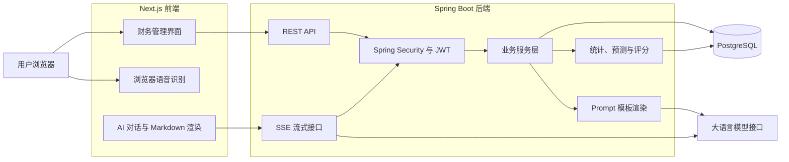

# AI Finance Assistant

## 智能个人财务管理系统

AI Finance Assistant 是一个基于 Next.js、Spring Boot、PostgreSQL 和大语言模型构建的全栈个人财务管理平台。

系统围绕“记录消费—分析数据—预测支出—生成建议—辅助决策”构建完整的个人财务管理流程，支持手动记账、语音记账、AI 自动分类、异常金额检测、预算管理、财务健康评分、支出预测、个性化省钱建议和流式 AI 财务咨询。

---

## 1. 项目功能

### 1.1 用户注册与登录

* 用户注册
* 用户登录
* Spring Security 权限控制
* JWT 无状态身份认证
* 密码加密存储
* 登录状态校验
* 不同用户之间的数据隔离

### 1.2 消费账单管理

* 新增消费记录
* 查看账单详情
* 修改消费记录
* 删除消费记录
* 分页查询
* 按消费项目、商家和备注搜索
* 按消费分类筛选
* 按日期范围筛选
* 按金额范围筛选
* 按异常等级筛选
* 按时间或金额排序

### 1.3 AI 自动分类

用户输入消费项目、商家或自然语言消费描述后，系统调用大语言模型分析消费内容并推荐账单分类。

AI 分类结果包含：

* 推荐分类
* 分类代码
* 分类名称
* 识别置信度
* 判断理由
* 是否需要人工确认

### 1.4 自然语言与语音记账

用户可以输入或说出类似下面的内容：

```text
今天中午买了两杯咖啡，一共38元，
晚上打车回家花了46元。
```

系统将文本交给 AI 处理并提取为多条结构化账单，包括：

* 消费项目
* 商家
* 金额
* 数量
* 单位
* 消费时间
* 账单分类
* 备注
* AI 置信度

用户可以在保存前检查和修改识别结果。

语音功能支持：

* 中文普通话识别
* 英语识别
* 浏览器实时语音转文字
* 用户偏好中的语音语言联动
* 一次识别多条消费记录
* 批量保存账单

### 1.5 异常金额检测

系统会根据多项信息判断一笔消费是否可能存在金额错误：

* 价格参考规则
* 用户所在地区
* 地区物价系数
* 用户日常消费水平
* 商品数量与单位价格
* 用户历史同类消费中位数
* 异常提醒灵敏度

异常等级包括：

| 等级        | 说明               |
| --------- | ---------------- |
| `NONE`    | 金额处于合理范围         |
| `NOTICE`  | 金额相对偏高或偏低，建议检查   |
| `WARNING` | 金额明显异常，保存前需要再次确认 |

用户可以在偏好设置中关闭异常金额提醒。

### 1.6 用户偏好设置

用户可以设置：

* 所在地区
* 地区代码
* 地区物价系数
* 日常消费水平
* 月收入
* 默认月预算
* 是否开启异常提醒
* 异常提醒灵敏度
* 页面语言
* 语音识别语言
* 默认币种

这些设置会参与异常检测、AI 财务顾问和个性化省钱建议的生成。

### 1.7 月度预算管理

* 设置每月总预算
* 设置不同消费分类的预算
* 修改已有预算
* 删除预算
* 查看预算使用比例
* 查看已经使用的金额
* 查看剩余预算
* 查看预算状态
* 切换查看不同月份的数据

### 1.8 财务数据分析

系统通过账单、分类、预算、用户偏好、预测和健康评分等多张数据表联合计算财务数据。

主要分析指标包括：

* 本月总支出
* 本月消费笔数
* 日均支出
* 月预算使用比例
* 剩余预算
* 分类支出金额
* 分类支出占比
* 最高消费分类
* 最近月份支出趋势
* 异常账单数量

### 1.9 下月支出预测

系统最多读取最近六个月的有效消费记录，根据可用历史数据自动选择预测算法。

| 历史数据  | 使用方式        |
| ----- | ----------- |
| 无历史月份 | 数据不足估算      |
| 1至2个月 | 历史平均值       |
| 3个月   | 加权移动平均      |
| 4至6个月 | 加权移动平均与趋势修正 |

预测结果包括：

* 预测月份
* 预测金额
* 预测下限
* 预测上限
* 使用的历史月份数量
* 预测算法
* 模型版本
* 预测解释

### 1.10 财务健康度评分

系统从多个维度计算用户的财务健康评分：

* 预算控制情况
* 消费稳定性
* 收入与结余能力
* 消费分类结构
* 异常消费风险

最终生成：

* 财务总分
* 各维度得分
* 财务健康等级
* 评分说明

财务健康等级包括：

* `EXCELLENT`
* `GOOD`
* `FAIR`
* `RISK`

### 1.11 个性化省钱建议

系统结合以下内容生成个性化建议：

* 用户所在地区
* 地区物价水平
* 日常消费水平
* 月收入
* 默认月预算
* 当前预算使用情况
* 分类消费结构
* 下月支出预测
* 财务健康评分

建议以 Markdown 形式展示，并保存历史记录。

用户可以将建议标记为：

* 待处理
* 已采纳
* 已忽略

### 1.12 AI 财务顾问

系统包含类 ChatGPT 的财务咨询页面。

主要功能：

* 创建多个咨询会话
* 保存会话历史
* 自动生成会话标题
* 查询当前财务状况
* 结合历史账单回答问题
* 结合预算和用户偏好回答问题
* Markdown 内容渲染
* SSE 流式输出
* 会话归档
* Loading 与错误状态显示

---

## 2. 页面路由

| 路由           | 功能        |
| ------------ | --------- |
| `/`          | 系统入口      |
| `/register`  | 用户注册      |
| `/login`     | 用户登录      |
| `/dashboard` | 财务总览      |
| `/expenses`  | 账单管理      |
| `/voice`     | 语音与自然语言记账 |
| `/analytics` | 财务数据分析    |
| `/advice`    | 个性化省钱建议   |
| `/advisor`   | AI 财务顾问   |
| `/settings`  | 用户偏好与预算设置 |

---

## 3. 技术栈

### 前端

* Next.js 16.2.9
* React 19.2.4
* TypeScript
* Tailwind CSS 4
* Recharts
* React Markdown
* Remark GFM
* Zod
* Lucide React

### 后端

* Java 21
* Spring Boot 3.5.14
* Spring Web
* Spring Data JPA
* Spring Security
* OAuth2 Resource Server
* Spring AI 1.1.8
* Bean Validation
* Spring Boot Actuator
* Maven

### 数据库

* PostgreSQL 16
* PGVector PostgreSQL 镜像
* Flyway
* JSONB
* JPA 实体关联
* 数据库索引
* 外键与唯一约束

当前项目使用了 PGVector 兼容数据库镜像，但当前业务版本尚未实现基于向量检索的 RAG 功能。

### AI

* Anthropic 兼容模型接口
* Spring AI ChatClient
* PromptTemplateService
* AI 消费分类
* AI 结构化账单提取
* AI 个性化省钱建议
* AI 财务对话
* SSE 流式输出

### DevOps

* Docker
* Docker Compose
* Docker 多阶段构建
* 容器健康检查
* 环境变量管理
* Next.js Standalone 模式

---

## 4. 系统架构



---

## 5. 项目结构

```text
personal-project-margheritadzh-creator/
├── frontend/
│   ├── public/
│   ├── src/
│   │   ├── app/
│   │   ├── components/
│   │   ├── lib/
│   │   ├── schemas/
│   │   └── types/
│   ├── Dockerfile
│   ├── next.config.ts
│   ├── package.json
│   └── tsconfig.json
├── src/
│   └── main/
│       ├── java/
│       │   └── cs/sbs/web/personalprojectweb2026/
│       │       ├── config/
│       │       ├── controller/
│       │       ├── dto/
│       │       ├── entity/
│       │       ├── exception/
│       │       ├── repository/
│       │       ├── security/
│       │       ├── service/
│       │       └── util/
│       └── resources/
│           ├── db/migration/
│           └── application.properties
├── Dockerfile
├── docker-compose.yml
├── pom.xml
├── .env.example
├── README.md
└── README-project.md
```

其中：

* `README.md` 为课程提供的项目要求。
* `README-project.md` 为本项目说明文档。

---

## 6. 数据库管理

项目使用 Flyway 管理数据库结构。

当前迁移文件：

```text
V1__init_schema.sql
V2__seed_initial_data.sql
```

首次启动后端时，Flyway 会自动：

1. 创建数据库表。
2. 创建表关联、索引和约束。
3. 写入初始分类数据。
4. 写入价格参考规则。
5. 创建数据库迁移历史记录。

已经执行过的 Flyway 迁移文件不应直接修改。后续数据库结构变化应通过新增迁移文件完成。

---

## 7. 环境变量

项目根目录需要存在 `.env` 文件。

可以复制示例配置：

```bash
cp .env.example .env
```

需要填写的主要敏感变量：

```text
POSTGRES_PASSWORD
JWT_SECRET
ANTHROPIC_AUTH_TOKEN
```

注意事项：

* `.env` 不应上传到 Git。
* `JWT_SECRET` 长度不能少于32字节。
* 数据库密码应与 `POSTGRES_PASSWORD` 保持一致。
* 浏览器访问后端时使用 `http://localhost:8080`。
* Docker 后端访问数据库时使用 `postgres:5432`。
* Mac 本地访问数据库时使用 `localhost:5433`。

---

## 8. Docker 一键运行

### 8.1 前置条件

* 已安装 Docker Desktop
* Docker Desktop 正在运行
* 项目根目录存在配置正确的 `.env`

### 8.2 构建并启动全部服务

在项目根目录执行：

```bash
docker compose up --build -d
```

Docker Compose 会启动以下服务：

| 服务          | 容器名称               | 宿主机端口  |
| ----------- | ------------------ | ------ |
| PostgreSQL  | `finance-postgres` | `5433` |
| Spring Boot | `finance-backend`  | `8080` |
| Next.js     | `finance-frontend` | `3000` |

端口映射说明：

```text
Mac localhost:5433
        ↓
PostgreSQL 容器内部 5432
```

### 8.3 查看容器状态

```bash
docker compose ps
```

### 8.4 查看日志

查看全部服务日志：

```bash
docker compose logs -f
```

查看后端日志：

```bash
docker compose logs -f backend
```

查看前端日志：

```bash
docker compose logs -f frontend
```

### 8.5 访问地址

```text
前端：http://localhost:3000
后端：http://localhost:8080
健康检查：http://localhost:8080/actuator/health
数据库：localhost:5433
```

### 8.6 停止服务

```bash
docker compose down
```

删除容器并清除数据库卷：

```bash
docker compose down -v
```

警告：使用 `-v` 会同时删除 Docker 数据库中的用户、账单和其他业务数据。

---

## 9. 本地开发运行

开发过程中可以只用 Docker 启动 PostgreSQL，前端和后端在本地运行。

### 9.1 启动数据库

```bash
docker compose up -d postgres
```

数据库连接参数：

```text
Host：localhost
Port：5433
Database：finance_db
Username：finance_user
```

### 9.2 启动 Spring Boot 后端

在项目根目录执行：

```bash
./mvnw spring-boot:run
```

后端地址：

```text
http://localhost:8080
```

### 9.3 启动 Next.js 前端

打开新的终端窗口：

```bash
cd frontend
npm ci
npm run dev
```

前端地址：

```text
http://localhost:3000
```

---

## 10. 推荐项目演示流程

1. 注册新用户并登录。
2. 进入偏好与预算设置页面。
3. 设置地区、物价系数、消费水平、月收入和默认预算。
4. 设置本月总预算与分类预算。
5. 进入语音记账页面。
6. 使用中文或英语输入多笔消费。
7. 展示语音转文字结果。
8. 展示 AI 结构化提取结果。
9. 修改其中一条账单并批量保存。
10. 添加一笔明显异常的消费，展示金额提醒。
11. 进入账单管理页面。
12. 展示关键词搜索、筛选、排序和分页。
13. 进入财务总览和分析页面。
14. 展示分类统计、预算使用情况和支出趋势。
15. 生成下月支出预测。
16. 生成财务健康评分。
17. 生成个性化省钱建议。
18. 将建议标记为已采纳或已忽略。
19. 进入 AI 财务顾问页面。
20. 提交与当前账单相关的问题。
21. 展示 SSE 流式输出、Markdown 渲染和历史会话。

---

## 11. 课程功能要求对应情况

| 课程要求                  | 当前实现               |
| --------------------- | ------------------ |
| Spring Boot 3.2+      | Spring Boot 3.5.14 |
| PostgreSQL 16+        | 已实现                |
| Spring Security + JWT | 已实现                |
| AI 自动分类消费账单           | 已实现                |
| 根据历史数据预测下月支出          | 已实现                |
| 个性化省钱建议               | 已实现                |
| 语音记账                  | 已实现                |
| 多表联动统计                | 已实现                |
| 财务健康度评分               | 已实现                |
| Prompt 模板管理           | 已实现统一 Prompt 渲染服务  |
| 类 ChatGPT 对话组件        | 已实现                |
| Markdown 渲染           | 已实现                |
| SSE 或 WebSocket       | 已实现 SSE            |
| AI 请求 Loading 状态      | 已实现                |
| TypeScript            | 已实现                |
| Docker Compose 一键运行   | 已配置                |
| 外网部署                  | 尚未完成               |
| Vector Store / RAG    | 尚未实现               |

---

## 12. 当前限制

* 语音识别依赖浏览器 Speech Recognition API。
* 推荐使用最新版 Chrome 浏览器。
* AI 功能需要有效的大模型 API Token。
* 模型接口不可用时，AI 分类、建议和对话功能无法正常工作。
* 支出预测需要一定数量的历史账单。
* 历史数据较少时，预测结果仅供参考。
* 当前版本尚未完成外网部署。
* 当前版本未实现 RAG 或向量检索。
* 页面语言偏好可以保存，但完整的中英文界面切换尚未完成。

---

## 13. 安全设计

* 用户密码以加密哈希形式保存。
* 后端使用无状态 JWT 鉴权。
* 受保护接口需要携带 Access Token。
* 用户只能访问自己的财务数据。
* 数据库密码和模型 Token 通过环境变量传递。
* `.env` 文件已排除在 Git 提交范围外。
* 后端使用 Bean Validation 校验输入。
* 异常金额需要用户确认后才能保存。
* AI 提取的账单需要用户检查后再写入数据库。

---

## 14. AI 辅助开发说明

本项目在开发过程中使用生成式 AI 辅助完成了以下工作：

* 项目需求分析
* 前后端代码建议
* 编译错误与运行错误排查
* 数据库和 Docker 配置检查
* UI 布局和文案优化
* 项目文档整理

所有功能设计、代码选择、修改操作和最终结果均由开发者检查与确认。

AI 辅助开发比例：

```text
提交前填写：____%
```

